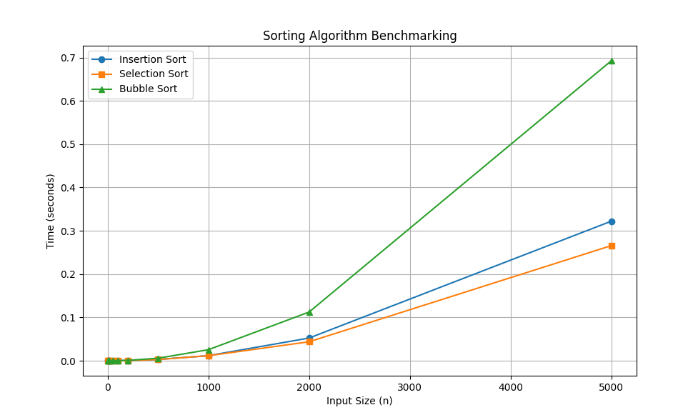

# Result of Benchmark code 

```
System Info: CPU: AMD64 Family 25 Model 97 Stepping 2, AuthenticAMD, RAM: 31.12 GB
insertion_sort | Size: 5 | Time: 0.000005 sec
insertion_sort | Size: 10 | Time: 0.000004 sec
insertion_sort | Size: 20 | Time: 0.000006 sec
insertion_sort | Size: 50 | Time: 0.000031 sec
insertion_sort | Size: 100 | Time: 0.000116 sec
insertion_sort | Size: 200 | Time: 0.000463 sec
insertion_sort | Size: 500 | Time: 0.002886 sec
insertion_sort | Size: 1000 | Time: 0.011643 sec
insertion_sort | Size: 2000 | Time: 0.052337 sec
insertion_sort | Size: 5000 | Time: 0.322267 sec
selection_sort | Size: 5 | Time: 0.000005 sec
selection_sort | Size: 10 | Time: 0.000005 sec
selection_sort | Size: 20 | Time: 0.000008 sec
selection_sort | Size: 50 | Time: 0.000030 sec
selection_sort | Size: 100 | Time: 0.000106 sec
selection_sort | Size: 200 | Time: 0.000400 sec
selection_sort | Size: 500 | Time: 0.002735 sec
selection_sort | Size: 1000 | Time: 0.011529 sec
selection_sort | Size: 2000 | Time: 0.043736 sec
selection_sort | Size: 5000 | Time: 0.265832 sec
bubble_sort | Size: 5 | Time: 0.000007 sec
bubble_sort | Size: 10 | Time: 0.000006 sec
bubble_sort | Size: 20 | Time: 0.000011 sec
bubble_sort | Size: 50 | Time: 0.000056 sec
bubble_sort | Size: 100 | Time: 0.000224 sec
bubble_sort | Size: 200 | Time: 0.000818 sec
bubble_sort | Size: 500 | Time: 0.005720 sec
bubble_sort | Size: 1000 | Time: 0.025387 sec
bubble_sort | Size: 2000 | Time: 0.112378 sec
bubble_sort | Size: 5000 | Time: 0.692765 sec
```

# Graph 



